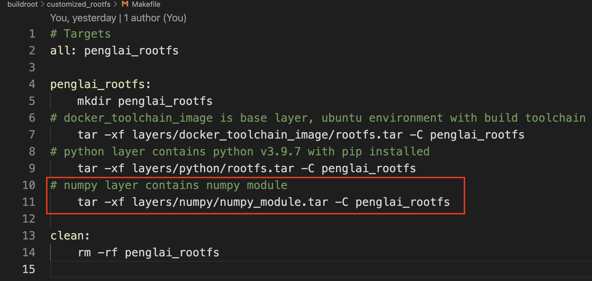
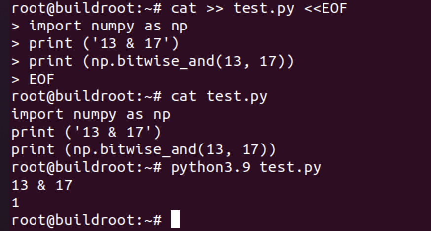
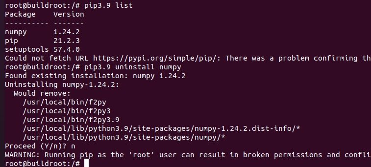
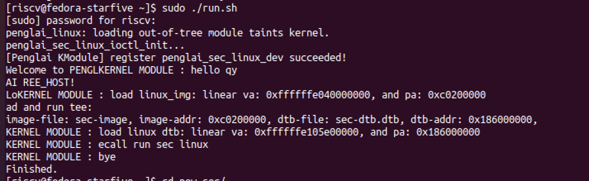
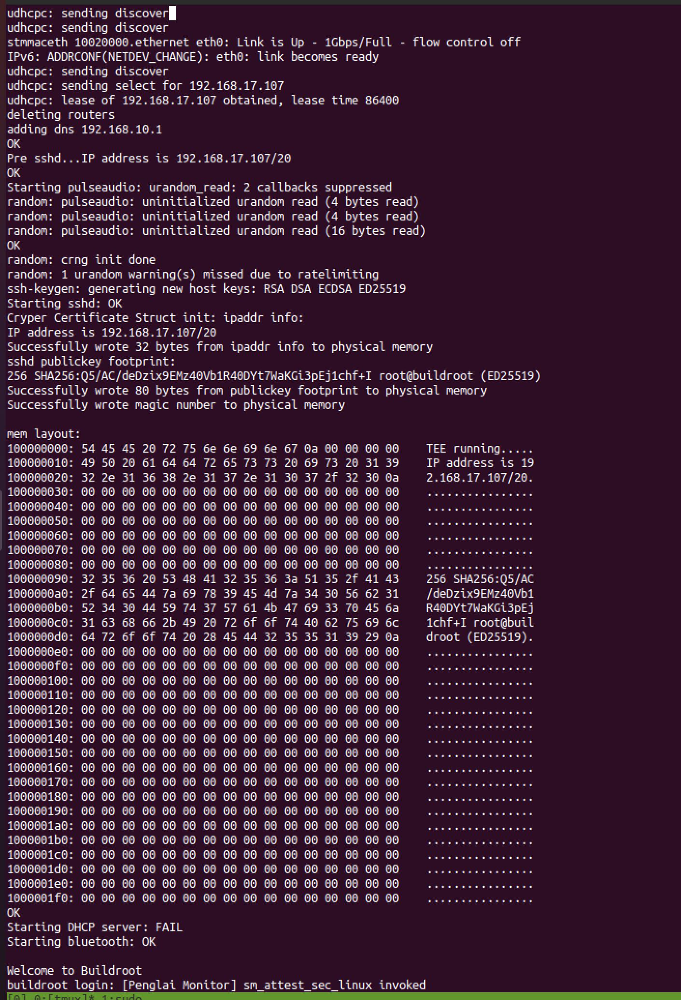
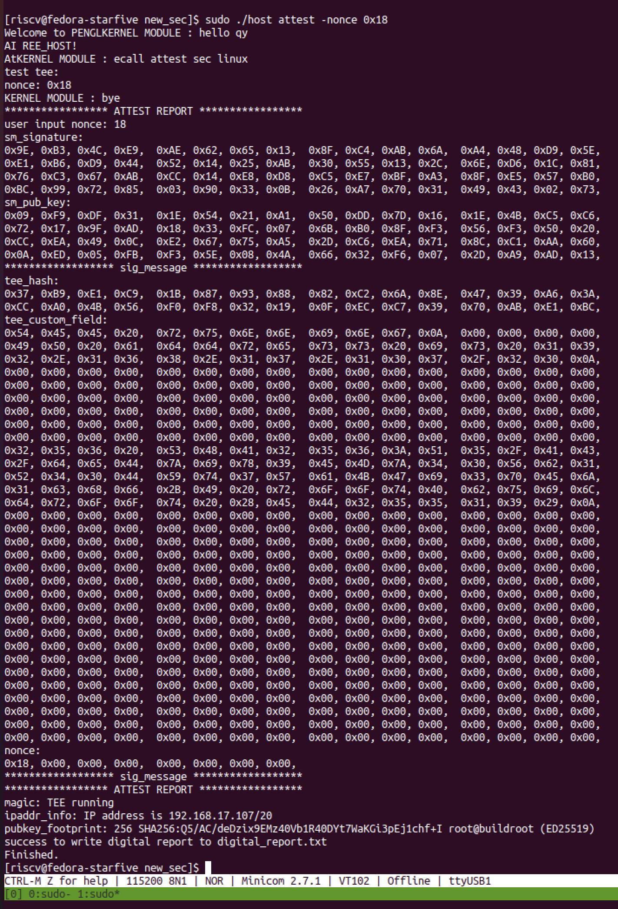
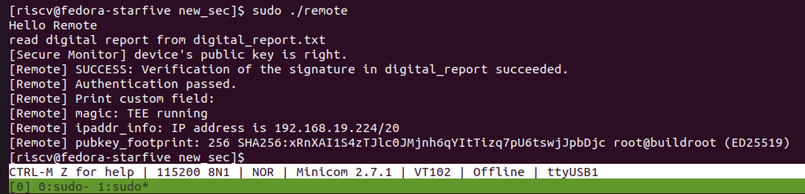
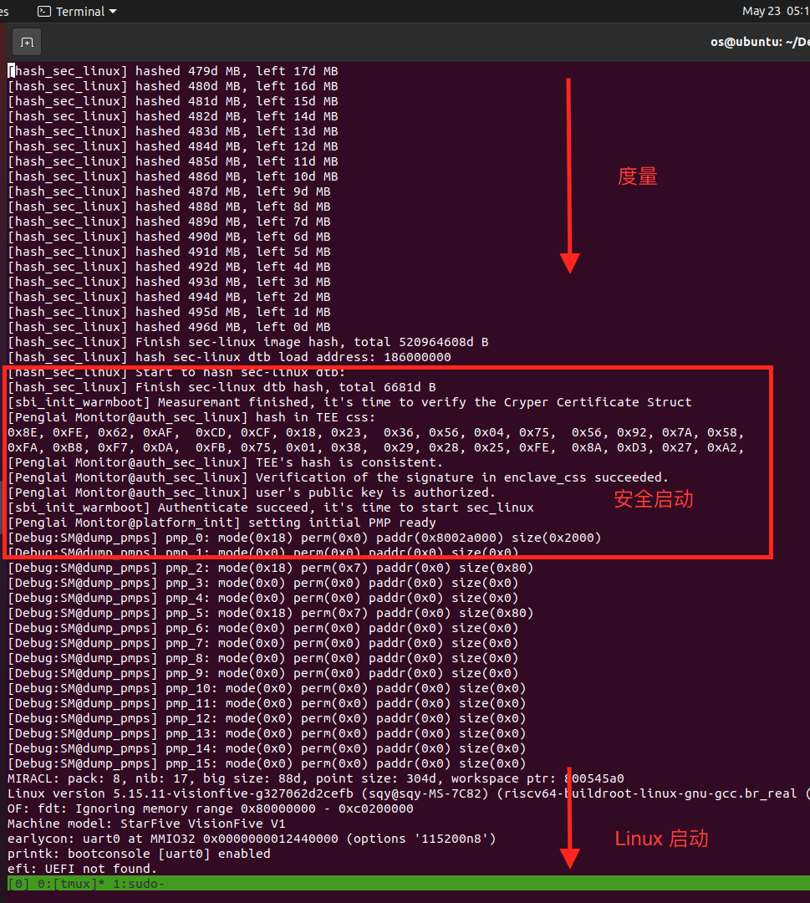

# Penglai-secure-world

## RISC-V TEE 安全/非安全世界模型

实现安全/非安全世界间内存隔离，为安全世界提供设备安全能力。在安全世界中运行Linux，从而实现对现有成熟Linux程序的后向兼容。


## 仓库结构

需要编译的 Artifacts 包括 Visionfive V1 开发板上除 secondBoot 和 ddrinit 外的所有软件，下图显示了主代码仓库Penglai-secure-world的目录结构，接下来将根据启动顺序依次介绍代码仓库和编译对象间的对应关系：

```
➜  Penglai-secure-world git:(main) ✗ tree
.
├── starfive-normal-linux
├── starfive-penglai
│   ├── conf
│   ├── docs
│   ├── openEuler-files
│   ├── openeuler-kernel
│   ├── opensbi-0.9
│   ├── patches
│   ├── penglai-enclave-driver
│   ├── penglai-selinux-driver
│   ├── penglai-selinux-sdk
│   ├── riscv-qemu
│   ├── scripts
│   └── sdk
├── starfive-secure-linux
│   ├── bsp
│   ├── buildroot
│   ├── conf
│   ├── HiFive_U-Boot
│   ├── linux
│   ├── opensbi
│   └── soft_3rdpart
└── starfive-uboot
```
- secondBoot 和 ddrinit 直接使用赛昉预编译好的可执行文件，文件下载以及烧录、重置等相关操作请参考[VisionFive Single Board Computer Quick Start Guide.pdf](https://starfivetech.com/uploads/VisionFive%20Single%20Board%20Computer%20Quick%20Start%20Guide.pdf)
- OpenSBI & u-boot 是实施了 domain 机制，添加了蓬莱 Secure monitor 的，分别对应子仓库starfive-penglai/opensbi-0.9 和 starfive-uboot，从源码编译请参考[VisionFive Single Board Computer Software Technical Reference Manual.pdf](https://starfivetech.com/uploads/VisionFive%20Single%20Board%20Computer%20Software%20Technical%20Reference%20Manual.pdf)，其编译产物为 firmware_payload.bin.out。
- Normal Linux 所需的内核镜像、设备树由子仓库starfive-normal-linux 编译得到，仍参考[VisionFive Single Board Computer Software Technical Reference Manual.pdf](https://starfivetech.com/uploads/VisionFive%20Single%20Board%20Computer%20Software%20Technical%20Reference%20Manual.pdf)，编译产物为fedora_with_modules.gz和visionfive-v1-uart-reserved-plic-nonet.dtb。
- Normal Linux 用于加载 Secure Linux 的内核驱动和用户态程序将从子仓库starfive-penglai编译，分别对应penglai-selinux-driver和penglai-selinux-sdk这两个目录，编译产物为penglai_linux.ko 和host。
- Secure Linux 对应子仓库starfive-secure-linux，其内核镜像和设备树从目录starfive-secure-linux/linux编译，其 initramfs 从目录starfive-secure-linux/buildroot编译并打包在内核镜像中，编译产物为sec-image 和 sec-dtb.dtb。

## 运行测试

介绍在赛昉VisionFive v1开发板上的部署并测试的过程。

### 一、工具与环境准备

#### 硬件
如下图，硬件需要两个串口转换器，分别连接板上的UART3和UART1，参考[StarFive 40-Pin GPIO Header User Guide](https://doc-en.rvspace.org/General/PDF/StarFive_40-Pin_GPIO_Header_UG.pdf)完成接线，同时还需要一张SD卡和一个SD卡读卡器。主机软件可使用minicom 来连接串口。


#### 软件环境
使用 Ubuntu 20.04.5 LTS x86_64 作为编译和制作SD卡的软件环境，如图所示：


### 二、代码仓库初始化

克隆代码仓库，更新子模块，并安装编译所需依赖。项目编译后约20G，请留意磁盘空间。
```
git clone https://github.com/Shang-QY/Penglai-secure-world.git
cd Penglai-secure-world
git submodule update --init --recursive
```
```
sudo apt update
sudo apt upgrade
sudo apt-get install autoconf automake autotools-dev bc bison xxd \
build-essential curl flex gawk gdisk git gperf libgmp-dev \
libmpc-dev libmpfr-dev libncurses-dev libssl-dev libtool \
patchutils python screen texinfo unzip zlib1g-dev device-tree-compiler libyaml-dev
```
设置后续操作中要使用的、代表仓库根目录的环境变量。
```
export SECURE_WORLD_DIR=$(pwd)
```

### 三、编译

一键编译所有软件模块，编译所需的时间较长。
```
./script/build_all.sh
```
在编译结束后，最终需要的编译产物被放在`out`目录下，结构如下所示：


### 四、制作SD卡

一键制作SD卡，将插有SD卡的读卡器连接到主机（Linux系统），确定SD卡对应的设备，图中SD卡对应的设备为`/dev/sda`：


执行脚本并以设备名为参数（执行过程较快，起初需要输入sudo密码）：
```
./script/make_sdcard.sh -d /dev/sda
```

### 五、安装软件到SD卡中

一键安装编译产物到SD卡中（除`fw_payload.bin.out`外），此过程非常快。
```
./script/install_all.sh -d /dev/sda
```

### 六、烧录固件

请参考[VisionFive Single Board Computer Quick Start Guide.pdf](https://starfivetech.com/uploads/VisionFive%20Single%20Board%20Computer%20Quick%20Start%20Guide.pdf)中的`Appendix B: Updating Firmware and u-boot`部分，烧录fw_payload.bin.out

### 七、启动运行

使用minicom分别连接好两个串口。根据赛昉引脚手册[StarFive 40-Pin GPIO Header User Guide](https://doc-en.rvspace.org/General/PDF/StarFive_40-Pin_GPIO_Header_UG.pdf)，可以看到UART3是ddrinit、secondboot、OpenSBI、U-boot所使用的串口，即系统启动早期输出将从UART3打印。之后Normal linux使用UART1作为串口设备启动，启动过程将将从UART1打印。后续被加载并启动的Secure linux则使用UART3作为串口设备。

上电，在UART1上看到Normal Linux 的启动过程，（使用用户名：riscv，密码：starfive）进入终端。执行：
```
sudo ./run.sh
```
之后将在UART3上看到Secure Linux 的启动过程，（使用用户名：root，密码：starfive）进入终端。接着在Secure Linux 的终端执行`python`即可进入python 命令行。

运行结果截屏如图所示：（左边是UART3串口-安全世界终端，右边是UART1串口-非安全世界终端）


## Python 运行环境集成

本节介绍Python包的安装、使用和静态集成方式，以`numpy`为例（numpy已安装好，可直接使用）。

### 一、定制你的编译运行环境

在源码目录`starfive-secure-linux/buildroot/customized_rootfs`中的`Makefile`中可见我们的编译运行环境是由这几层组成的：



不同环境以类似Docker Image的层叠方式组合在一起，通过修改`Makefile`进行定制。请注意层叠顺序，后解压的会覆盖先前已有的同名文件。

### 二、在主根目录与编译运行环境间切换

请务必挂载特殊的系统目录到编译运行环境，否则会出错。使用chroot命令进入编译运行环境。
```
mount --bind /dev /root/penglai_rootfs/dev
mount --bind /sys /root/penglai_rootfs/sys
mount --bind /proc /root/penglai_rootfs/proc

chroot /root/penglai_rootfs/ bash
```

在编译运行环境中使用exit命令退出并回到进入前所在的目录。
```
exit
```

### 三、安装和使用Python包

假设已经进入编译运行环境，Python安装在编译运行环境的usr/local/bin/目录下，需添加到环境变量中：

```
export PATH=$PATH:/usr/local/bin/
python3.9 --version
pip3.9 --version
```

#### 安装
Buildroot默认系统时间为1970年，使用date指令重设系统时间：

```
date -s 2022-03-01
```

使用pip安装包（由于不支持ssl所以需对包源添加`--trusted-host`参数），等待直到安装完成。
```
pip3.9 install --trusted-host pypi.org --trusted-host pypi.python.org --trusted-host files.pythonhosted.org numpy
```

#### 使用
运行简单的numpy应用程序进行测试：

```
cat >> test.py <<EOF
import numpy as np
print ('13 & 17')
print (np.bitwise_and(13, 17))
EOF

python3.9 test.py
```




### 四、定位相关包文件并拷贝到源码目录

以将numpy包拷贝到源码目录为例：

```
pip3.9 list
pip3.9 uninstall numpy
```



如图，可以看到numpy包的相关文件包括，我们切换到主根目录并使用tar指令打包。注意打包需在penglai_rootfs目录下，以使包中目录结构与源码目录一致，便于后续集成。

```
cd penglai_rootfs

tar -cf numpy_module.tar usr/local/bin/f2py* usr/local/lib/python3.9/site-packages/numpy*
```

可以在主根目录下解压以查看内容：

```
mv numpy_mudule.tar .. && cd ..
tar -xf numpy_module.tar
```

使用scp指令拷贝到源码目录（请事先在源码目录中创建用于保存压缩包的目录，示例中该目录为`customized_rootfs/layers/numpy`）：

```
scp numpy_module.tar <username>@<hostname>:<Penglai-secure-world DIR>/starfive-secure-linux/buildroot/customized_rootfs/layers/numpy/
```


### 五、静态集成Python包

假设已添加到`customized_rootfs/layers/numpy`目录，这时可以修改Makefile以在编译运行环境中集成新的环境（也就是添加图中画线的这行）：


在主仓库目录重新编译即可。

## 从 Docker image 生成 Rootfs

新增支持从 Docker image 生成 Rootfs，放在`starfive-secure-linux/buildroot/docker_rootfs`，Python环境保留不变。

请注意，应通过配置`starfive-secure-linux/buildroot_initramfs_config`来选择集成Python环境还是集成Docker image环境。具体内容请参考`starfive-secure-linux/buildroot/docker_rootfs/README.sh`。

可通过阅读`starfive-secure-linux/buildroot/Makefile`，搜索`BR2_PENGLAI_DOCKER_ROOTFS`快速了解buildroot ramfs的自定义构建过程。

## 远程验证

我们支持远程验证，可在新版本上编译测试。

使用host启动运行TEE，过程与原来一致：



在启动过程中，OpenSBI会先度量TEE，之后启动secure linux。在secure linux启动的最后阶段，我们添加了启动项（在`starfive-secure-linux/buildroot/tools`下，包含了用于测试的开发者公私钥，公钥将写入到`/root/.ssh/authorized_keys`中，使用对应的私钥即可ssh登陆。同时包含启动项，分别用于配制网络和sshd以及向custom_field中写入信息）

下图输出显示在串口UART0中，secure linux启动后期会打印写入到custom_field中的字节（图中TEE running是标记启动完成的魔数）：



下图是显示当secure linux还没启动完毕时，normal侧通过host请求attest的结果。


下图是显示当secure linux启动完毕时，normal侧通过host请求attest的结果。



下图是显示当normal侧通过remote程序检查数字报告的结果。



## TEE安全启动（Verified boot）

我们支持TEE安全软件的安全启动，功能已加入最新的构建系统，重新编译即可测试。以下将按设计目标、总体设计和代码实现分别说明。

### 设计目标：
#### 一、支持启动控制策略 

云服务供应商为云租户提供运行TEE的硬件平台，但在硬件安全的保护下云供应商没有能力监管TEE的行为。如果不限制平台能够运行的TEE，而用户恰恰使用TEE做违法犯罪的事情，那么云供应商将因此承担法律责任(用户可以说TEE不是自己开发的所以不知道会这样)。所以必须要有一种机制，能够使云平台限制可运行的飞地(即启动控制)，这些飞地的内容审查由云平台所信任的第三方机构完成，同时，第三方机构通过开发者资质核查能在发生意外时追究开发者的责任。 

另一方面，TEE的使用者与开发者可能不是同一个人或同一个组织，这对于安全软件的复用来说至关重要，因为现实软件的复杂度已不允许终端服务企业从零构建他们的安全应用。而可信执行环境作为硬件安全技术，并不能保证软件安全，对于飞地预期行为也一无所知。于是就产生了使用者对闭源飞地安全性及行为的信任问题，需要由受信任的第三方机构对闭源飞地做安全鉴定(就像华为应用市场为其中应用做出的保证那样)。 

PenglaiZone希望通过基于白名单的开发者身份核验机制，解决以上问题。通过灵活的白名单配置机制，由南湖作为第三方信任的根基，并可以支持潜在的多个受信任第三方机构。 


#### 二、提供期望度量

远程验证是证明TEE真实性和完整性的必要手段。通过这一过程用户得到来自安全监视器的TEE报告，其中包含安全监视器对TEE的测量。测量值由TEE的物理页内容(代表内存完整性)以及重要元数据(如CPU核心、设备隔离保护情况)经哈希算法计算得到。用户将报告中的测量值与期望测量相比较，如果一致就证明TEE是正确的。 

但如何得到期望的测量呢？用户需要有硬件平台或模拟器来成功试运行自己开发的TEE，并把安全环境中报告的测量值记录下来作为将来用于比对的期望测量。这太麻烦了。蓬莱的签名工具应该是易用且功能丰富的命令行程序，不依赖于安全监视器，甚至与指令集架构无关， 可用来生成飞地的期望测量，也可从已发布TEE所包含的签名结构中获取期望测量。 


### 总体设计：

整体流程设计如下:

首先，在飞地构建时，签名工具负责为用户编译出的TEE内核镜像文件附加签名结构，这由构建系统在最后一步代为完成，之后用户可以得到包含开发者数字签名证书的文件，此文件可以被分发。✅

在加载启动TEE时，安全监视器会检查数字签名结构，从中获取测量和签名，只有签名验证通过（内容完整）、TEE实际测量与指定测量一致、且开发者白名单交验通过，才会启动TEE。✅

### 代码实现

签名工具实现在`starfive-penglai/penglai-selinux-sdk/sign_tool`。其目录下的`README.md`详细介绍了实现及使用方式。

为支持加载启动时的安全验证，host应用程序（`starfive-penglai/penglai-selinux-sdk/host`）被拓展以支持在参数中指定数字签名证书文件。Monitor中的验证逻辑位于`starfive-penglai/opensbi-0.9/lib/sbi/sm/attest.c`中的`auth_sec_linux()`函数中。

运行时，UART0中的输出如下所示：


