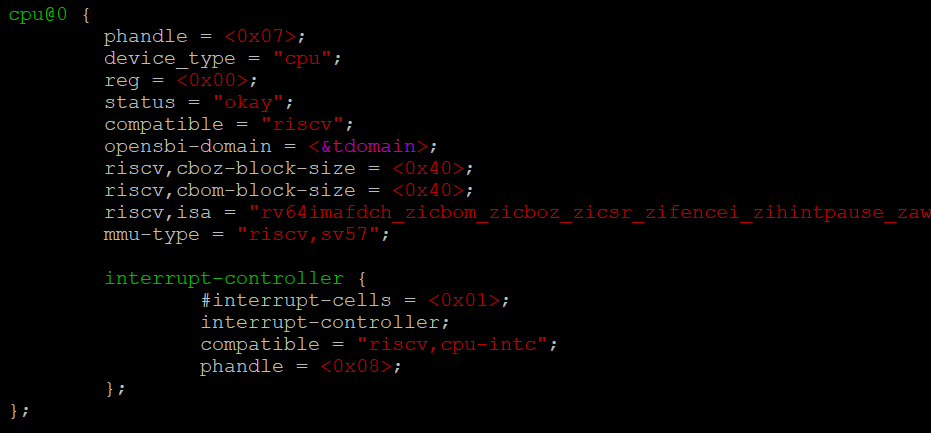

[](https://github.com/Penglai-Enclave/Penglai-Enclave-sPMP/actions/workflows/build.yml)

[](https://license.coscl.org.cn/MulanPSL)


## Introduction

Penglai is a RISC-V TEE system, which is designed to be **secure**, **high-performant**, and **scalable**.
This repo maintains OpenSBI version of Penglai Enclave based on PMP.

**How to use?**

Simply replace the OpenSBI used in your system with opensbi-0.9 in the top directory in the repo.

For TEE OS circumstance, you can customize device tree for domain isolation, as well define and use customized SBI call to utilize our base layer interface for domain switch and communication (Refer to UEFI STMM/ OPTEE cases for help). 

For bare-metal virtual machine, you can use our SDK and selinux-driver to customize your trusted VM environment(ramfs), load, run and attest your own VM.

## Status and Info

Status: experimental: it's still experimental version now, please refer our TVM version for more features.

You can refer our [Penglai-TVM](https://github.com/Penglai-Enclave/Penglai-Enclave-TVM) for more advanced features, including inter-enclave communication, secure storage, shadow fork, and others.

## Case: Running UEFI standaloneMm(STMM) with Penglai

### Requirements

There are three main components to run this demo: OpenSBI-w/PenglaiZone, EDK2 and QEMU. They all use git for source code management, the latter two are in other repositories. Penglai uses Docker for building. We recommend you to use Ubuntu(at least 20.04) for easier dependencies-solving when building EDK2 and QEMU.

Therefore, the only requirement to build and run penglai-uefi-demo is:

- [Docker](https://docs.docker.com): for building/running Penglai
- Git: for downloading the code

### Build QEMU

Select any dir as $WORKDIR, we will download and compile QEMU, EDK2 and PenglaiZone all in it.

```
export WORKDIR=`pwd`
git clone https://github.com/qemu/qemu.git
cd qemu
git checkout -b v8.1.0-rc0

## Apply the patch https://lore.kernel.org/all/20230425073509.3618388-1-yong.li@intel.com/
b4 am -o- https://lore.kernel.org/all/20230425073509.3618388-1-yong.li@intel.com | git am -3
./configure --target-list=riscv64-softmmu,riscv64-linux-user --enable-sdl --enable-sdl-image --enable-gtk --enable-slirp
make -j $(nproc)
cp build/riscv64-softmmu/qemu-system-riscv64 $WORKDIR
```

QEMU should be installed now in $WORKDIR

### Build UEFI and StandaloneMM

```
cd $WORKDIR
git clone https://github.com/tianocore/edk2-staging edk2 -b RiscV64StandaloneMm
cd edk2
git submodule update --init --recursive --depth=1
. edksetup.sh
make -C BaseTools
export GCC5_RISCV64_PREFIX=/usr/bin/riscv64-linux-gnu-
build -a RISCV64 -t GCC5 -p OvmfPkg/RiscVVirt/RiscVVirtQemu.dsc -b DEBUG -DSECURE_BOOT_ENABLE=TRUE
build -a RISCV64 -t GCC5 -p OvmfPkg/RiscVVirt/RiscVVirtQemuStandaloneMm.dsc -b DEBUG -D FW_BASE_ADDRESS=0x80C00000
```

Three FD files will be generated  
Build/RiscVVirtQemu/DEBUG_GCC5/FV/RISCV_VIRT_CODE.fd,
Build/RiscVVirtQemu/DEBUG_GCC5/FV/RISCV_VIRT_VARS.fd,
Build/RiscVVirtQemuStandaloneMm/DEBUG_GCC5/FV/STANDALONE_MM.fd.
Then copy `RISCV_VIRT_CODE.fd`, `RISCV_VIRT_VARS.fd` and `STANDALONE_MM.fd` to the $WORKDIR directory:'

```
cp Build/RiscVVirtQemu/DEBUG_GCC5/FV/RISCV_VIRT_CODE.fd $WORKDIR
cp Build/RiscVVirtQemu/DEBUG_GCC5/FV/RISCV_VIRT_VARS.fd $WORKDIR
cp Build/RiscVVirtQemuStandaloneMm/DEBUG_GCC5/FV/STANDALONE_MM.fd $WORKDIR
```

### Build OpenSBI (with PenglaiZone support)

```
cd $WORKDIR
git clone https://github.com/Penglai-Enclave/PenglaiZone
docker run -v $(pwd):/home/penglai/penglai-enclave -w /home/penglai/penglai-enclave --rm -it ddnirvana/penglai-enclave:v0.5 bash
```

Then In the Penglai docker container, execute
```
cd /home/penglai/penglai-enclave/PenglaiZone/opensbi-0.9
mkdir -p build-oe/qemu-virt-mm
CROSS_COMPILE=riscv64-unknown-linux-gnu- make O=build-oe/qemu-virt-mm PLATFORM=generic FW_PAYLOADMM=y FW_PAYLOADMM_PATH=/home/penglai/penglai-enclave/STANDALONE_MM.fd
exit
``` 

### Run the UEFI and StandaloneMm firmware

**Edit the Device Tree**
 1. Device Tree comes from qemu default dts, and it need to be extended for reserve memory and domain configration.   Non-secure shared memory between UEFI and standalone MM is allocated at 0xFFE00000. The non-secure shared memory base address should be passed to UEFI through the device tree
```
cd $WORKDIR
./qemu-system-riscv64 -nographic -machine virt,dumpdtb=qemu-virt.dtb -smp 4 -m 2G -bios ./PenglaiZone/opensbi-0.9/build-oe/qemu-virt-mm/platform/generic/firmware/fw_dynamic.elf
sudo apt-get install device-tree-compiler
dtc -I dtb -O dts -o qemu-virt.dts qemu-virt.dtb
```

 2. Change the qemu-virt.dts file to add the shared NsMemory (put the below content right after the memoy@80000000 section)
```
reserved-memory {
    #address-cells = <0x2>;
    #size-cells = <0x2>;
    ranges;
    mmode_resv0@FFE00000 {
        reg = <0 0xFFE00000 0 0x200000>;
    };
};
```

3. Change the qemu-virt.dts to re-write the '/chosen' node as below (this is to use PenglaiZone domain mechanism)

```
chosen {
    rng-seed = <0xa899d8a9 0x580621b5 0x4091be1a 0x35e2d6f0 0x9d222f71 0x2ec9e7a 0x2cd6e6fa 0x627e40bc>;
    stdout-path = "/soc/serial@10000000";

    opensbi-domains {
        compatible = "opensbi,domain,config";

        tmem1: tmem1 {
            compatible = "opensbi,domain,memregion";
            base = <0x0 0x80200000>;
            order = <21>;
        };

        tmem2: tmem2 {
            compatible = "opensbi,domain,memregion";
            base = <0x0 0x80c00000>;
            order = <22>;
        };

        tmem3: tmem3 {
            compatible = "opensbi,domain,memregion";
            base = <0x0 0x81000000>;
            order = <24>;
        };


        allmem: allmem {
            compatible = "opensbi,domain,memregion";
            base = <0x0 0x0>;
            order = <64>;
        };

        udomain: untrusted-domain {
            compatible = "opensbi,domain,instance";
            possible-harts = <&cpu0>;
            regions = <&tmem1 0x0>, <&tmem2 0x0>, <&tmem3 0x0>, <&allmem 0x7>;
            boot-hart = <&cpu0>;
            next-arg1 = <0x0 0xbfe00000>;
            next-addr = <0x0 0x22000000>;
            next-mode = <0x1>;
            system-manager;
        };

        tdomain: trusted-domain {
            compatible = "opensbi,domain,instance";
            possible-harts = <&cpu0>, <&cpu1>, <&cpu2>, <&cpu3>;
            regions = <&allmem 0x7>;
            boot-hart = <&cpu0>;
            next-arg1 = <0x0 0x82200000>;
            next-addr = <0x0 0x80200000>;
            next-mode = <0x1>;
            system-reset-allowed;
            pre-start-prio = <0x1>;
            measure-region = <0x0 0x80200000 0x0 0x300000>;
        };
    };
};
```

4. Change the qemu-virt.dts to bind all cpu nodes to to 'tdomain'

Add opensbi-domain = <&tdomain> to all the cpu@1, cpu@2, cpu@3, cpu@4 filelds



5. Then generate the new dtb file, (ignore the interrupts_extended_property warnings)
```
dtc -I dts -O dtb -o qemu-virt-new.dtb qemu-virt.dts
```

**Run in QEMU**

Here the secure variable storage will be put at 0x20000000, the flash0 block in Qemu virt machine. The EDK2 EFI firmware will be put at 0x22000000, the flash1 block in Qemu virt machine.

Create a "run.sh" script as below content

```
nc -z  127.0.0.1 54320 || /usr/bin/gnome-terminal -x ./soc_term.py 54320 &
nc -z  127.0.0.1 54321 || /usr/bin/gnome-terminal -x ./soc_term.py 54321 &
while ! nc -z 127.0.0.1 54320 || ! nc -z 127.0.0.1 54321; do sleep 1; done
./qemu-system-riscv64 -nographic \
  -M virt,pflash0=pflash0,pflash1=pflash1,acpi=off \
  -m 4096 -smp 2 \
  -dtb ./qemu-virt-new.dtb \
  -bios ./PenglaiZone/opensbi-0.9/build-oe/qemu-virt-mm/platform/generic/firmware/fw_dynamic.elf \
  -blockdev node-name=pflash0,driver=file,read-only=on,filename=RISCV_VIRT_CODE.fd \
  -blockdev node-name=pflash1,driver=file,filename=RISCV_VIRT_VARS.fd \
  -serial tcp:localhost:54320 -serial tcp:localhost:54321 \
  -device qemu-xhci -device usb-mouse -device usb-kbd \
  -drive file=fat:rw:~/src/fat,id=hd0 -device virtio-blk-device,drive=hd0
```  


Then downlaod the soc_term.py script and run the run.sh script in Linux Desktop GUI shell

```
truncate -s 32M ./RISCV_VIRT_CODE.fd
truncate -s 32M ./RISCV_VIRT_VARS.fd

wget -c https://github.com/DevendraDevadiga/optee_qemu_armv8a_prebuilt_binaries/raw/main/optee_qemu_armv8a/soc_term.py
chmod a+x soc_term.py
chmod a+x run.sh
./run.sh
```

Now, standaloneMm and UEFI will boot and use two different console for logging. Please refer [edk2 demo README](./edk2/README.md) for secure boot details.

## Case: Running Bare-metal CVM with Penglai

Please refer branch 'cvm' for build and evaluate instructions.

## License Details

Mulan Permissive Software License，Version 1 (Mulan PSL v1)

## Code Structures

- opensbi-0.9: The Penglai-equipped OpenSBI, version 0.9
- edk2: UEFI standaloneMm(STMM) demo related files. Including device tree file, compile scripts and secure boot guideline.

## Code Contributions

Please fell free to post your concerns, ideas, code or anything others to issues.

## Document and Tutorial

Please refer our readthedocs page for [documents](https://penglai-doc.readthedocs.io/).

## Cite

To cite Penglai, please consider using the following bibtex:
```
@inproceedings {273705,
	author = {Erhu Feng and Xu Lu and Dong Du and Bicheng Yang and Xueqiang Jiang and Yubin Xia and Binyu Zang and Haibo Chen},
	title = {Scalable Memory Protection in the {PENGLAI} Enclave},
	booktitle = {15th {USENIX} Symposium on Operating Systems Design and Implementation ({OSDI} 21)},
	year = {2021},
	isbn = {978-1-939133-22-9},
	pages = {275--294},
	url = {https://www.usenix.org/conference/osdi21/presentation/feng},
	publisher = {{USENIX} Association},
	month = jul,
}
```
## Collaborators

We thank all of our collaborators (companies, organizations, and communities).

[](https://www.huawei.com/) |[](https://www.nucleisys.com/) |[](https://starfivetech.com/) |[](http://www.is.cas.cn/) |
:---: |:---: |:---: |:---: |
[Huawei (华为)](https://www.huawei.com/) |[Nuclei (芯来科技)](https://www.nucleisys.com/) |[StarFive (赛昉科技)](https://starfivetech.com/) |[ISCAS(中科院软件所)](http://www.is.cas.cn/) |

[](https://openeuler.org/) |[](https://www.openharmony.cn/) |[](https://gitee.com/openeuler/secGear) |
:---: |:---: |:---: |
[openEuler community](https://openeuler.org/) |[OpenHarmony community](https://www.openharmony.cn/) |[secGear framework](https://gitee.com/openeuler/secGear)|

## Acknowledgements

The design of Penglai was inspired by Sanctum, Keystone and HexFive, thanks to their great work!

