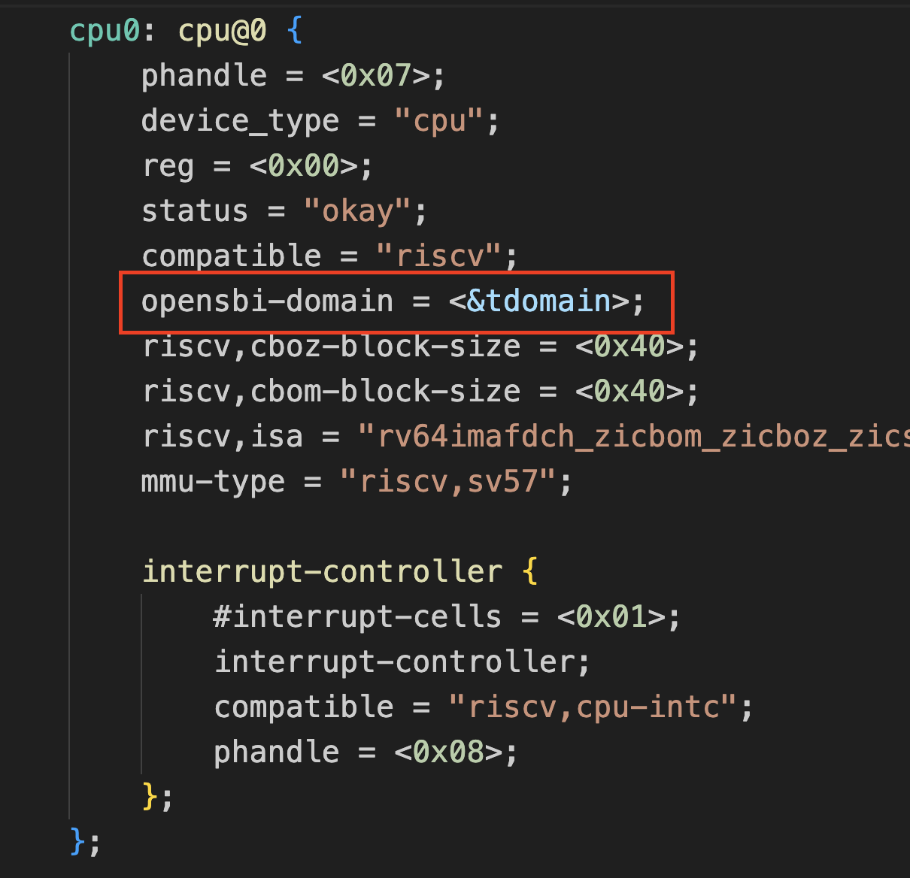
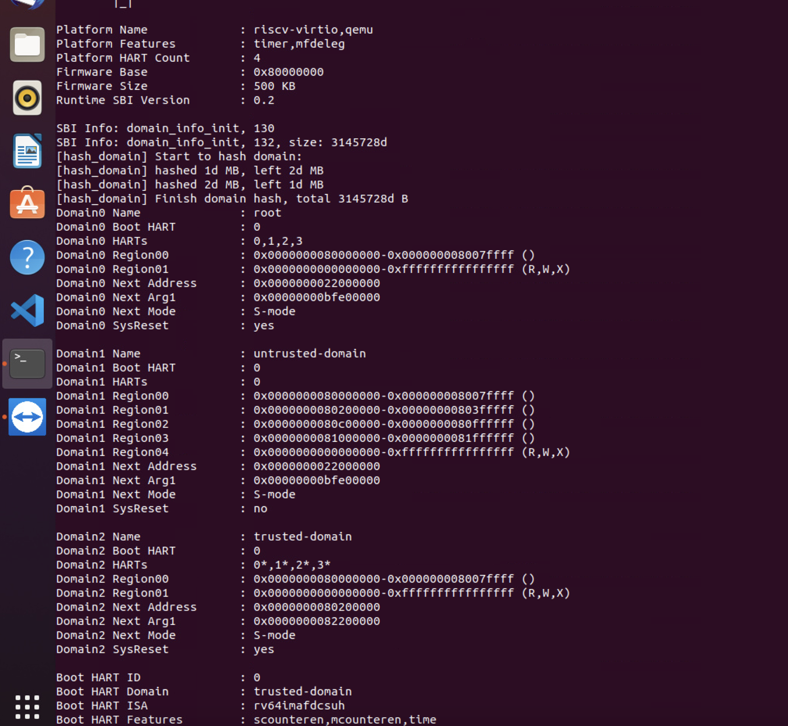

# Overview

This directory holds the UEFI implementation for RiscV Virt machine including 
a S-Mode EDK2 firmware and a StandaloneMm firmware which can be taken as a payload 
of the OpenSBI or a TEE.

# How to build (Linux Environment)

## Obtaining source code

Create a directory $WORKDIR that would hold source code of the components.

  Edk2: https://github.com/yli147/edk2/commits/devel-standalonemm
  
  OpenSBI: https://github.com/yli147/Penglai-Enclave-sPMP/commits/devel-standalonemm

## Manual building

### 1. Compile QEMU

   ```
   export WORKDIR=`pwd`
   cd qemu
     -- Apply the patches
   		https://www.mail-archive.com/qemu-devel@nongnu.org/msg956276.html
		https://www.mail-archive.com/qemu-devel@nongnu.org/msg956228.html
   ./configure --target-list=riscv64-softmmu,riscv64-linux-user --enable-sdl --enable-sdl-image --enable-gtk --enable-slirp
   make -j $(nproc)
   cp build/riscv64-softmmu/qemu-system-riscv64 ../
   ```

  QEMU should be installed now in $WORKDIR

### 2. Compile UEFI and StandaloneMM for QEMU Virt

   ```
   cd $WORKDIR
   git clone https://github.com/yli147/edk2.git edk2 -b devel-standalonemm
   cd edk2
   git submodule update --init --recursive --depth=1
   . edksetup.sh
   make -C BaseTools
   export GCC5_RISCV64_PREFIX=/usr/bin/riscv64-linux-gnu-
   build -a RISCV64 -t GCC5 -p OvmfPkg/RiscVVirt/RiscVVirtQemu.dsc -b DEBUG -DSECURE_BOOT_ENABLE=TRUE
   build -a RISCV64 -t GCC5 -D FW_BASE_ADDRESS=0x80C00000 -D EDK2_PAYLOAD_OFFSET -p OvmfPkg/RiscVVirt/RiscVVirtQemuStandaloneMm.dsc -b DEBUG
   ```
  
  Three FD files will be generated  
  Build/RiscVVirtQemu/DEBUG_GCC5/FV/RISCV_FLASH0.fd,
  Build/RiscVVirtQemu/DEBUG_GCC5/FV/RISCV_VIRT.fd,
  Build/RiscVVirtQemuStandaloneMm/DEBUG_GCC5/FV/STANDALONE_MM.fd.
  Then copy `RISCV_FLASH0.fd`, `RISCV_VIRT.fd` and `STANDALONE_MM.fd` to the $WORKDIR directory:
   ```
   cp Build/RiscVVirtQemu/DEBUG_GCC5/FV/RISCV_FLASH0.fd $WORKDIR
   cp Build/RiscVVirtQemu/DEBUG_GCC5/FV/RISCV_VIRT.fd $WORKDIR
   cp Build/RiscVVirtQemuStandaloneMm/DEBUG_GCC5/FV/STANDALONE_MM.fd $WORKDIR
   ```

### 3. Compile OpenSBI (Penglai-Enclave-sPMP)

   ```
   cd $WORKDIR
   git clone https://github.com/yli147/Penglai-Enclave-sPMP.git Penglai-Enclave-sPMP -b devel-standalonemm
   docker run -v $(pwd):/home/penglai/penglai-enclave -w /home/penglai/penglai-enclave --rm -it ddnirvana/penglai-enclave:v0.5 bash
   ```
  
  In the Penglai docker container
   ```
   cd /home/penglai/penglai-enclave/Penglai-Enclave-sPMP/opensbi-0.9
   mkdir -p build-oe/qemu-virt-mm
   CROSS_COMPILE=riscv64-unknown-linux-gnu- make O=build-oe/qemu-virt-mm PLATFORM=generic FW_PAYLOADMM=y FW_PAYLOADMM_PATH=/home/penglai/penglai-enclave/STANDALONE_MM.fd
   exit
   ```

### 4. Generate the flash images
  The secure variable storage will be put at 0x20000000, the flash0 block in Qemu virt machine.
  The EDK2 EFI firmware will be put at 0x22000000, the flash1 block in Qemu virt machine.
   ```
   cd $WORKDIR
   rm flash0.img
   dd if=/dev/zero of=flash0.img bs=1M count=32
   dd if=./RISCV_FLASH0.fd of=flash0.img conv=notrunc
   rm flash1.img
   dd if=/dev/zero of=flash1.img bs=1M count=32
   dd if=./RISCV_VIRT.fd of=flash1.img conv=notrunc
   ```
  flash0.img contains the secure variable storage.
  flash1.img contains EDK2 EFI code.
 
### 5. Edit the Device Tree*
  Device Tree comes from qemu default dts, and it need to be extended for reserve memory and domain configration. There is a modified dts file `/Penglai-Enclave-sPMP/edk2/dts/qemu-virt-4hart.dts` which can be directly used for compiling the final dtb file(refer to the last part of this section for the compilation process). You can also follow below 2 steps to modify dts file manually.
  
#### Step 1:
  Non-secure shared memory between UEFI and standalone MM is
  allocated at 0xFFE00000. The non-secure shared memory base address
  should be passed to UEFI through the device tree
   ```
   cd $WORKDIR
   ./qemu-system-riscv64 -nographic -machine virt,dumpdtb=qemu-virt.dtb -smp 4 -m 2G -bios ./Penglai-Enclave-sPMP/opensbi-0.9/build-oe/qemu-virt-mm/platform/generic/firmware/fw_dynamic.elf
   sudo apt-get install device-tree-compiler
   dtc -I dtb -O dts -o qemu-virt.dts qemu-virt.dtb
   ```

  Change the qemu-virt.dts file to reserve the shared NsMemory (put the below content right after the memoy@80000000 section)
   ```
   reserved-memory {
     #address-cells = <0x2>;
     #size-cells = <0x2>;
     ranges;
     mmode_resv0@FFE00000 {
         reg = <0 0xFFE00000 0 0x200000>;
     };
   };
   ```
   

#### Step 2:
  Add the qemu-virt.dts file to use PenglaiZone domain mechanism. Declaring domain instances below the '/chosen' node and bind cpus to domains.

  Rewritten '/chosen' node is shown below:
  ```
  chosen {
		rng-seed = <0xa899d8a9 0x580621b5 0x4091be1a 0x35e2d6f0 0x9d222f71 0x2ec9e7a 0x2cd6e6fa 0x627e40bc>;
		stdout-path = "/soc/serial@10000000";

        opensbi-domains {
            compatible = "opensbi,domain,config";

            tmem1: tmem1 {
                compatible = "opensbi,domain,memregion";
                base = <0x0 0x80200000>;
                order = <21>;
            };

            tmem2: tmem2 {
                compatible = "opensbi,domain,memregion";
                base = <0x0 0x80c00000>;
                order = <22>;
            };

            tmem3: tmem3 {
                compatible = "opensbi,domain,memregion";
                base = <0x0 0x81000000>;
                order = <24>;
            };

            allmem: allmem {
                compatible = "opensbi,domain,memregion";
                base = <0x0 0x0>;
                order = <64>;
            };

            udomain: untrusted-domain {
                compatible = "opensbi,domain,instance";
                possible-harts = <&cpu0>;
                regions = <&tmem1 0x0>, <&tmem2 0x0>, <&tmem3 0x0>, <&allmem 0x7>;
                boot-hart = <&cpu0>;
                next-arg1 = <0x0 0xbfe00000>;
                next-addr = <0x0 0x22000000>;
                next-mode = <0x1>;
                system-manager;
            };

            tdomain: trusted-domain {
                compatible = "opensbi,domain,instance";
                possible-harts = <&cpu0>, <&cpu1>, <&cpu2>, <&cpu3>;
                regions = <&allmem 0x7>;
                boot-hart = <&cpu0>;
                next-arg1 = <0x0 0x82200000>;
                next-addr = <0x0 0x80200000>;
                next-mode = <0x1>;
                system-reset-allowed;
                pre-start-prio = <0x1>;
                measure-region = <0x0 0x80200000 0x0 0x300000>;
            };
        };
	};

  ```
  
  Rewritten '/cpu' node is shown below(here using cpu@0 for an example. In fact, every nodes need to be bound to 'tdomain'):

  

#### Compilation process:
  Then generate the new dtb file, (ignore the interrupts_extended_property warnings)
   ```
   dtc -I dts -O dtb -o qemu-virt-new.dtb qemu-virt.dts
   ```

# Memory layout and Bootup flow

### QEMU Virt Board IO Mapping


### QEMU Virt Board Boot Options
   ```
  -m 2G
  -bios ./Penglai-Enclave-sPMP/opensbi-0.9/build-oe/qemu-virt-mm/platform/generic/firmware/fw_dynamic.elf
  -drive file=./flash0.img,if=pflash,format=raw,unit=0
  -drive file=./flash1.img,if=pflash,format=raw,unit=1
  -serial tcp:localhost:54320 -serial tcp:localhost:54321
   ```
### QEMU Virt Boot Flow

  
# Running

  The flash0.img file contains secure variables,
  and the flash1.img file contains Non-secure UEFI code.
  
  You may create a "run.sh" script as below content
  
  ```
  nc -z  127.0.0.1 54320 || /usr/bin/gnome-terminal -x ./soc_term.py 54320 &
  nc -z  127.0.0.1 54321 || /usr/bin/gnome-terminal -x ./soc_term.py 54321 &
  while ! nc -z 127.0.0.1 54320 || ! nc -z 127.0.0.1 54321; do sleep 1; done
  ./qemu-system-riscv64 -nographic \
    -machine virt -smp 4 -m 2G \
    -dtb ./qemu-virt-new.dtb \
    -bios ./Penglai-Enclave-sPMP/opensbi-0.9/build-oe/qemu-virt-mm/platform/generic/firmware/fw_dynamic.elf \
    -drive file=./flash0.img,if=pflash,format=raw,unit=0 \
    -drive file=./flash1.img,if=pflash,format=raw,unit=1 \
    -serial tcp:localhost:54320 -serial tcp:localhost:54321 \
    -device qemu-xhci -device usb-mouse -device usb-kbd \
    -drive file=fat:rw:~/src/fat,id=hd0 -device virtio-blk-device,drive=hd0
  ```  
  Then downlaod the soc_term.py script and run the run.sh script in Linux Desktop GUI shell
  ```
  wget -c https://github.com/DevendraDevadiga/optee_qemu_armv8a_prebuilt_binaries/raw/main/optee_qemu_armv8a/soc_term.py
  chmod a+x soc_term.py
  chmod a+x run.sh
  ./run.sh
  ```
  
  You can also download and use this VariableTestApp to query the secure variable info in edk2 shell
  ```
  wget -c https://wiki.ith.intel.com/download/attachments/2844652828/VariableTestApp.efi -P ~/src/fat/
  ./run.sh 
  Shell> FS0:
  FS0:\> VariableTestApp.efi
  ```
  

## PenglaiZone screenshot

In boot stage, penglai will print domain configration like below:


